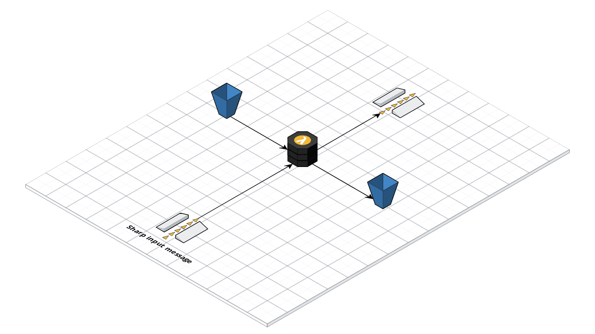

# sharp lambda boilerplate

Boilerplate using AWD CDK to deploy and run sharp powered tasks on AWS Lambda

## Goal

Bring together the user experience of developers using sharp with lambda and maintain a configuration that handle the best possible default.

## How to use this repository

This repository is meant to be used as a base for a new project that require to use sharp within lambda to process images.

Download the latest code from the main repository and use it as the basis for your project.

Send feedback in the repository issue queue about the problem you had, the change you've made, etc... to help the community.

## Deployment

The infrastructure stack takes an ENVIRONMENT variable as argument to bind the stack to a configuration.

Settings are set into sharp.json

### Deploy

```shell
ENVIRONMENT=prod yarn run deploy
```

### Destroy

```shell
ENVIRONMENT=prod yarn run destroy
```

## Example Tasks

The repository includes example tasks that are usable as basis of a production environment.

### Asynchronous Convert task

Task to convert and optionally resize image file with sharp asynchronously.

This task leverage SQS to handle conversion requests.

#### Infrastructure

SQS to lambda to destination SQS queue



#### Usage

Set the tasks settings in sharp.json

A SQS queue is created to receive conversion operation, and the result of the conversion operation is sent back to a specified queue url passed in the message payload.

The input payload message type can be found [here](./tasks/convert/types.js)

The output payload message type can be found [here](./tasks/convert/types.js)

#### Example

[Code example to send convert operation message](./docs/convertTasksExample.md)


### On the fly resized image api

Task to serve resized image on the fly.
